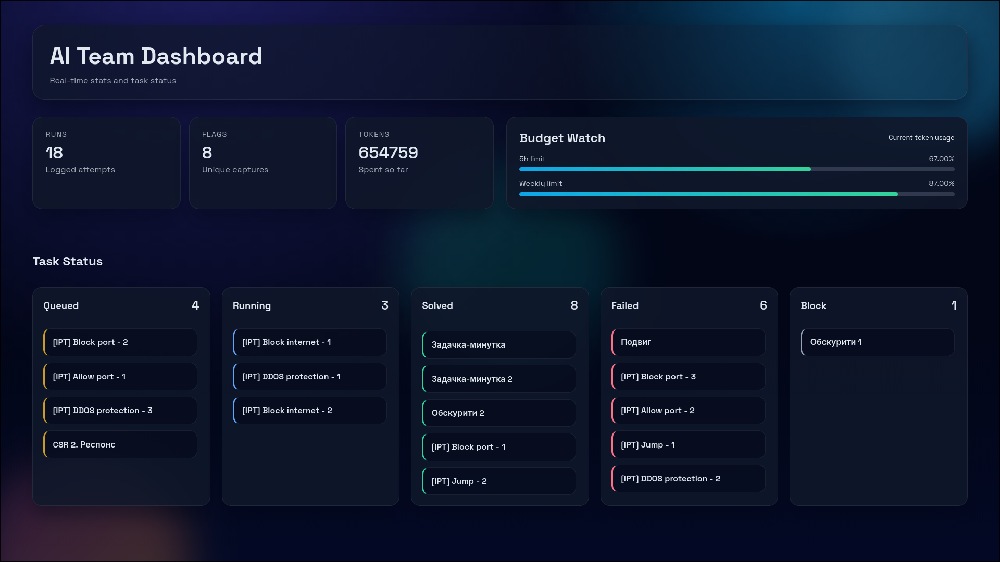

# AI-Team
<p align="center">Let AI solve CTF for you!</p>

<p align="center">
  
</p>

<b>DISCLAIMER</b>: If you want to learn something, <b>DO NOT</b> use AI-Team. It makes you lazy, stupid and may be considered as cheating.

## Requirements
- `Codex` installed with tokens (ChatGPT Plus)
- `Docker compose`
- `python 3.13`

## Quickstart

### Install and run AI-Team

Installation
```shell
git clone https://github.com/skeletona/AI-Team && cd AI-Team
```

```shell
pip install -r requirements.txt
```

Change settings (login and password):
```shell
vim .env
```

And then run:
```shell
./main run
```

After the tasks are downloaded, you can go to http://localhost:8000

## Usage
Available commands:
| Command   | Purpose                  | Example usage
| --------- | ------------------------ | ----------------------------------------- |
| `start`   | Run AI-Team              | `./main run codex website --attach codex` |
| `stop`    | Run Codex for every task | `./main stop web`                         |
| `restart` | Restart service          | `./main restart website -a`               |
| `status`  | Show status              | `./main status`                           |
| `attach`  | Attach to service        | `./main attach codex`                     |
| `clean`   | Cleaning                 | `./main clean all`                        |
| `sql`     | Look in database         | `./main sql`                              |

### Completions
You can add AI-Team commands to shell completions
```shell
./main --install-completion
export PATH="$PATH:."
exec $SHELL
```
<b>Careful</b>: Works only if current directory is in PATH

## Configuring

Look in `.env` if you want to change something

## How it works

| File         | Purpose                  | Usage               |
| ------------ | ------------------------ | ------------------- |
| `.env`       | Settings                 | `vim .env`          |
| `main.py`    | User commands            | `./main -h`         |
| `ctfd.py`    | Download tasks from CTFd | `./main download`   |
| `codex.py`   | Run Codex for every task | `./main codex -a`   |
| `website.py` | Flask server             | `./main website -a` |
| `db.py`      | Interact with sqlite3    | `./main sql`        |
| `models.py`  | Auxiliary garbage        |                     |

## Features
- All Codexes runs in docker
- Multiple attempts on one task
- Manually changing tasks status
- Modifiable prompts
- Codex logs on website

#### TODOs (maybe)
- Web-configurator for .env
- Codex logs summarization
- Full-fledged chat window
- Other AIs support (Gemini CLI)
- Non-CTFd boards
- AI-manager of AIs
- Rewrite all in Rust 🦀
- Extended statistics
- Attack-Defense support
